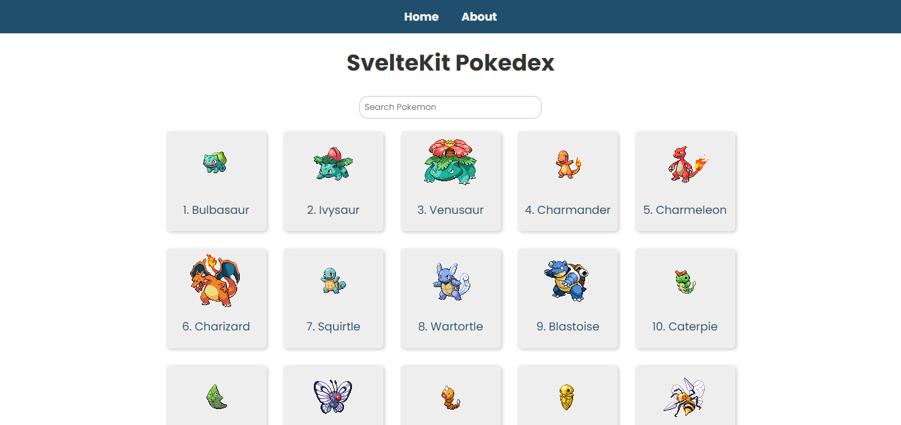

# SvelteKit Pokedex Website

A SvelteKit demo that uses the Pokemon API to build a pokedex. From a youtube course by James Q Quick

## Table of contents

- [Screenshot](#screenshot)
- [Built with](#built-with)
- [Project Takeaways](#project-takeaways)

### Screenshot

### Built with

- HTML5
- SCSS
- SvelteKit
- Desktop First Workflow

### Project Takeaways

- How to use SvelteKit
- How to use API's in projects
